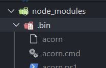

#全局安装Koa2脚手架
	npm install -g koa-generator
	然后找个文件夹
	koa2 xxxx就可以创建了

#脚手架创建的东西不能热启动
	安装热启动插件
	npm install nodemon --save，
	然后在package.json中配置

​	这个nodemon node bin/ww

​	这个bin 就是



```
"scripts": {
    "start": "node app.js",
    "dev":"nodemon node bin/www"
  }
```
然后可以npm run dev测试

#定义参数的验证
比如get,post 传入的参数，我们怎么验证他的合法性！！！?

LinValidator

#定义全局异常

**js中所有的异常源于Error这个类**

全局异常中间件的编写

1首先编写一个中间件

```js


const { HttpException } = require('../exceptions/HttpException')

const catchError = async (ctx, next) => {
    try {
        await next()
    } catch (error) {
        //已知异常
        if (error instanceof HttpException) {
            ctx.body = {
                msg: error.msg,
                error_code: error.errorCode,
                requeset: `${ctx.method} ${ctx.path}`,

            }
            ctx.status = error.code
        }
    }

}

module.exports = catchError
```

2写一个基类,你可以不用ParamException,直接给每次调用的方法中写，也可以像下面一样，写好直接调用

```js
class HttpException extends Error {

    constructor(msg = '服务器异常', errorCode = 1000, code = 400) {
        super()
        this.errorCode = errorCode
        this.code = code
        this.msg = msg
    }

}

class ParamException extends HttpException {

    constructor(msg, errorCode) {
        super()
        this.code = 400
        this.msg = msg || '参数错误'
        this.errorCode = errorCode || 10200
    }
}
module.exports = {
    HttpException,
    ParamException
}
```

3app.js中引入

```js
const catchError = require('./utils/exception')

const app = new Koa()

app.use(catchError)
```

#安装mysql库
npm install --save mysql2

其实这个mysql2就可以写sql语句来查询数据库了

这个是我们自己写的数据查询,koa2有框架像Hibernate一样操作数据库

```js
// get the client
const mysql = require('mysql2');
 
// create the connection to database
const connection = mysql.createConnection({
  host: 'localhost',
  user: 'root',
  database: 'test'
});
 
// simple query
connection.query(
  'SELECT * FROM `table` WHERE `name` = "Page" AND `age` > 45',
  function(err, results, fields) {
    console.log(results); // results contains rows returned by server
    console.log(fields); // fields contains extra meta data about results, if available
  }
);
 
// with placeholder
connection.query(
  'SELECT * FROM `table` WHERE `name` = ? AND `age` > ?',
  ['Page', 45],
  function(err, results) {
    console.log(results);
  }
);
```
#seqvuelize (相当于hibernate的orm)
npm install --save sequelize

npm install --save mysql2
https://github.com/demopark/sequelize-docs-Zh-CN/blob/master/core-concepts/getting-started.md
1定义配置文件

```js

const { Sequelize } = require('sequelize');

// 导入配置
const {
    dbName,
    host,
    port,
    user,
    password
} = require('../config/config').database

// 方法 2: 分别传递参数 (其它数据库)
const sequelize = new Sequelize(dbName, user, password, {
    dialect: 'mysql',
    host,
    port,
    logging:true,
    timezone:'+08:00'
  });

  /**
   * 这个必须调用这个方法
   */
  sequelize.sync()

  module.exports={
    sequelize
  }
```

2定义表类

```js
const { Sequelize, Model } = require('sequelize');
/**
 * 自己写的db
 */
const { sequelize } = require("../config/db")


class User extends Model {

}

User.init({
    id: {
        type: Sequelize.INTEGER,
        primaryKey: true
    },
    nickname: Sequelize.STRING,
    email: Sequelize.STRING,
    password: Sequelize.STRING
}, { sequelize })
```

3在app.js中导入

```js
/**
 *导入Model类 
 */
require("./models/User")
```

#获取参数中POST的参数
npm install koa-body
"koa-body": "^4.1.3"
这个工具，之前用过的koa-bodyparser获取不了body的参数我试过

```js
const Koa = require('koa');
const koaBody = require('koa-body');
 
const app = new Koa();
 
app.use(koaBody({ multipart: true }))
```

记住:app.use(koaBody({ multipart: true })) 一定要加个multipart: true，不然还是获取不到。


#路由

这个路由和我们的vue中的路由非常相似

```js
const Router =require("koa-router")
let router= new Router();

const user=require('../services/users')


/**
 * 这个就相当于我们Vue中的router/index.js
 * 默认跳转到哪个页面，
 * 然后配置路由
 */
router.get("/",async ctx=>{
  ctx.redirect("/users")
})

router.use('/users',user.routes())

module.exports= router

```

user就是路由组件

在app.js中导入路由

```js
const router = require('./routes')

app.use(router.routes())
app.use(router.allowedMethods())

```

